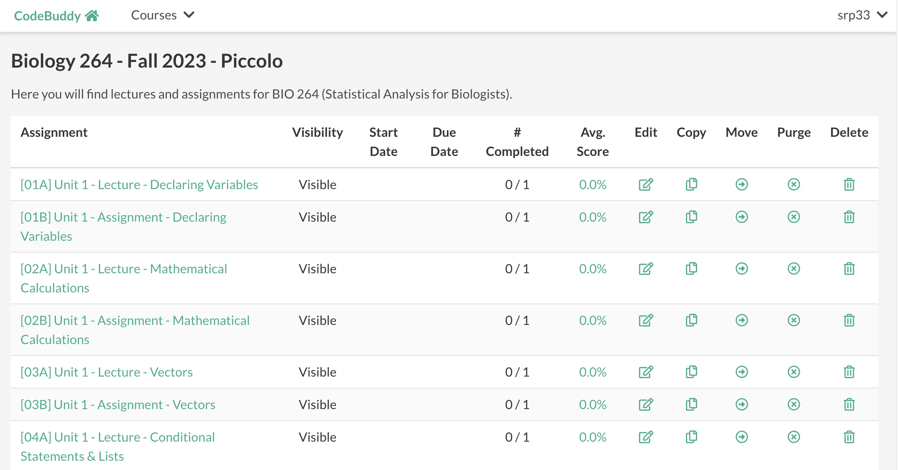
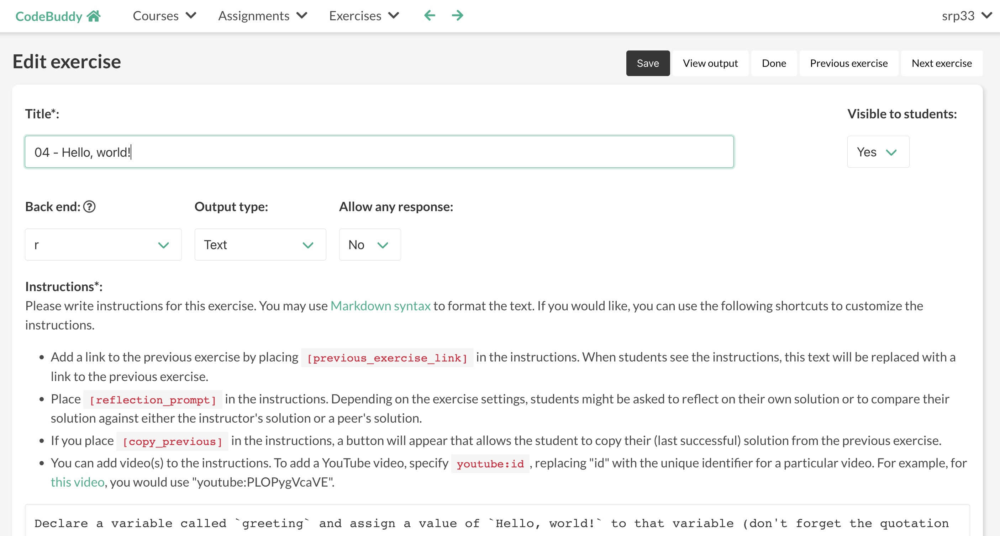
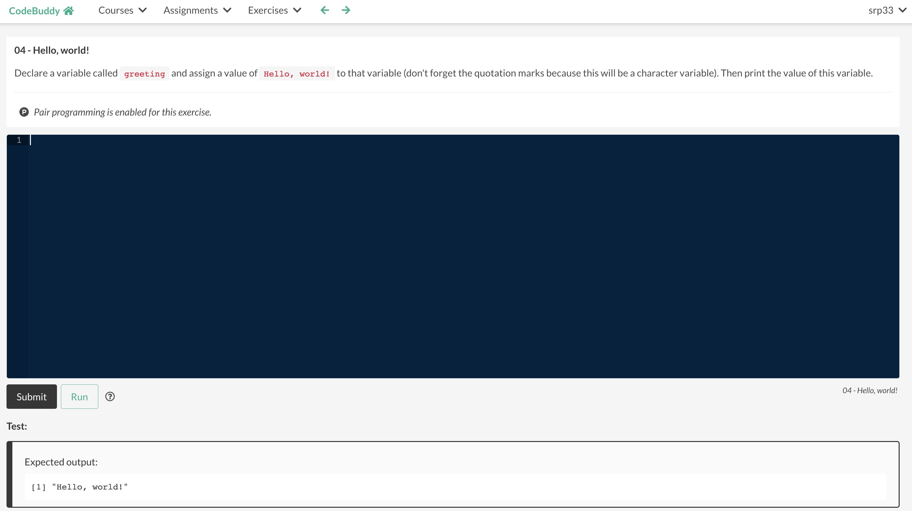
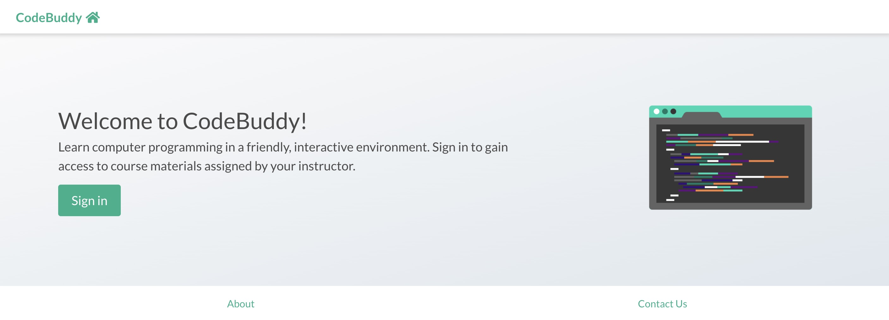
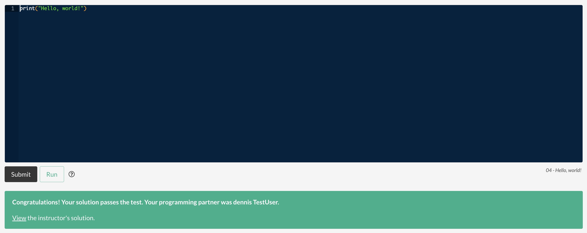
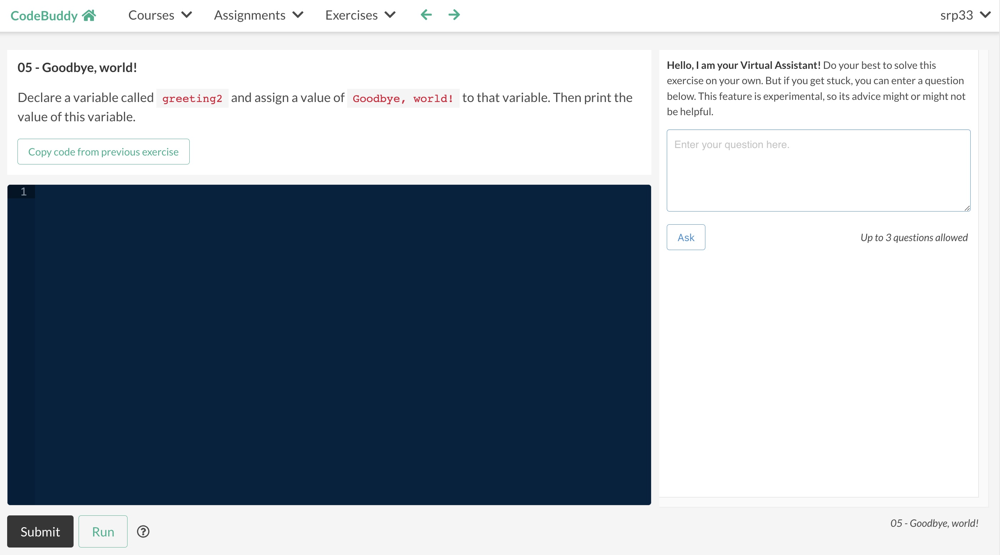

# Summary

CodeBuddy is a Web-based, learning management system for assessing computer-programming skills. It has been used in university courses since 2019. For a given course, instructors organize content according to assignments and specify configuration settings through a Web interface. After registering for a course, students complete exercises within assignments. When preparing a programming exercise, an instructor provides a solution. Additionally, the instructor may provide custom testing logic. CodeBuddy executes the instructor's solution to generate text- or graphics-based outputs that are used as an evaluation reference. To pass the exercise, a student's code must produce outputs matching the instructor's. (Their programming strategy may differ from the instructor's.) CodeBuddy stores users' inputs, outputs, scores, configuration settings, and more in a relational database. CodeBuddy provides many features intended to enhance student learning and supports pedagogical research, as described below. CodeBuddy's source code is available at https://github.com/srp33/CodeBuddy.

# Statement of Need

\autoref{fig:exercise}
\autoref{fig:instructor_solution}
\autoref{fig:virtual_assistant}

Many programming-oriented, learning management systems exist[TODO:refs]. Many are commercial applications that require monthly or term-based fees. Open-source tools have also been created[TODO:refs]. These provide benefits of transparency and extensibility. For example, if a researcher wishes to implement a new feature, they can modify open-source code accordingly. However, providing a comprehensive set of features and maintaining the code require considerable time investments. Therefore, many open-source learning management systems are not actively maintained or are no longer available[TODO].

We created CodeBuddy based on needs and opportunities identified in university-level, programming-oriented courses in the biological sciences. However, its functionality is also suitable for other disciplinary contexts, K-12 schools, or informal learning. CodeBuddy is designed for short-form programming exercises (typically, those that can be solved in hundreds of lines of code or fewer).

CodeBuddy provides features that one would expect in a modern learning management system, including user management, logging, and the ability to import, export, edit, copy, move, and delete content (Figure \autoref{fig:course_admin}). After landing on a home page (Figure \autoref{fig:home}), users authenticate using a third-party service (currently, Google). Instructors author instructions using Markdown syntax (Figure \autoref{fig:edit_exercise}). Students edit code using the Ajax.org Cloud9 Editor (Ace)[TODO:Cite it]. Ace provides basic code completion and formatting help. When a student's outputs do not match the expected outputs, they can see those differences in side-by-side panels. Instructors can create timed assignments; this feature is commonly used for quizzes and exams; while a student is completing a timed assignment, instructors can restrict access to other assignments in the course. Instructors can view course and assignment summaries that show the number of completed assignments per course and the number of completed exercises per assignment, respectively; average scores are also shown. Instructors may export scores as delimited text files. Instructors can review students' submissions and edit scores manually. To prevent security vulnerabilities, code is executed inside software containers with restricted permissions[TODO:cite]. At the time of this writing, the following scripting or compiled languages are supported: bash, C, C++, Java, Javascript, Julia, Python, R, and Rust.

For each programming language, a container image is defined (e.g., using Dockerfile commands). Each image defines a Linux operating-system environment with software to compile (if necessary) and execute code in the respective language. A separate configuration file provides language-specific information, such as how much memory usage to allow, whether text- and/or graphics-based outputs are supported, and code examples. Additionally, bash script(s) are provided for compiling (if necessary) the code, executing the code, and tidying the outputs (e.g., removing common warning or informational messages).

Here we highlight additional features that aim to support students' learning. To our knowledge, these features are not available in another open-source tool.

%TODO: Add a bullet point about graphics-based outputs (remove some wording above?)

* Instructors can configure exercises to support *pair programming*, an evidence-based teaching practice in which two students work on exercises side by side at a single computer[TODO]. When the "driver" student submits code, it (and the resulting score) are stored under the "navigator" student's account as well.
* Instructors can view a table of "at-risk" students who have not made any submissions in the past *x* number of hours (or days).
* Instructors can create tests with "hidden" inputs and/or outputs. For example, they can ask students to write a function that accepts certain arguments but not tell them what the values will be. This prevents students from circumventing test requirements.
* Instructors can write "verification" code to statically analyze students' code before it is executed. For example, they could verify that students do or do not use certain programming constructs.
* Instructors can provide starter code for students.
* Instructors can provide hints for students. Students can view the hints after clicking a button.
* Instructors can upload data file(s) as part of the inputs for a given exercise. They can require that students use the data to solve the exercise.
* Instructors can deliver video-based content. For example, they can embed a YouTube video and require that students post a code- or text-based response to that content.
* When students are completing an assignment (exam) in a controlled environment that has no Internet access, instructors can configure the assignment to allow access to specific external URLs.
* Instructors can allow students to download all of their code from a course as a single HTML file. Students often wish to use this feature at the end of a course.
* Instructors can assign users as teaching assistants (TAs). TAs can access the instructor's solutions and students' scores. They are not permitted to change some course settings.
* Instructors can configure an exercise so that students can click a button to copy their (last successful) solution from the previous exercise.
* When a user first creates an account, CodeBuddy randomly assigns them to either an "A" or "B" cohort. These groups can be used for A/B testing in a research context.

Finally, we note features that are designed to support students' learning and can be configured to be available to A) no students, B) all students, C) students in the "A" cohort, or D) students in the "B" cohort.

* Students can see the instructor's solution or anonymized solutions from peers after they have solved a given exercise[TODO:ref]. Instructors can configure the subsequent exercise so that students are required to write a reflection about their programming approach and how it compares with the instructor's solution or anonymized solutions from peers.
* Instructors can provide access to a "Virtual Assistant." The Virtual Assistant connects to OpenAI's ChatCompletion API[TODO]. When this feature is enabled, students can ask questions about their code and request help. Instructors can limit the number of interactions per student per exercise. This feature requires a paid account with OpenAI.

### Limitations

CodeBuddy is designed for short-form exercises rather than projects that require authoring multiple files. WebCAT is one alternative that has proven useful for project-oriented work[@edwards2008web].

CodeBuddy stores data in a SQLite database. Our experience has shown that this technology can support at least 150 users in a given semester. We are unsure of its ability to support larger numbers. Future work could adapt the software to use a database management system that supports greater scalability.

%Citations to entries in paper.bib should be in [rMarkdown](http://rmarkdown.rstudio.com/authoring_bibliographies_and_citations.html)
format.

%For a quick reference, the following citation commands can be used:
%- `@author:2001`  ->  "Author et al. (2001)"
%- `[@author:2001]` -> "(Author et al., 2001)"
%- `[@author1:2001; @author2:2001]` -> "(Author1 et al., 2001; Author2 et al., 2002)"

# Figures

%# Acknowledgements

%We a

# References